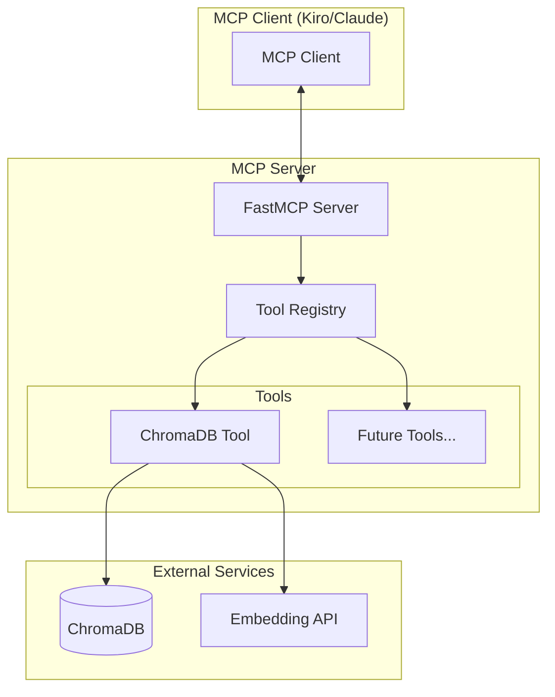

# Design Document

## Overview

Этот проект создает расширяемый MCP (Model Context Protocol) сервер с модульной архитектурой, который начинает с поддержки ChromaDB для векторного поиска и может легко расширяться новыми инструментами. Сервер будет использовать FastMCP SDK для Python, обеспечивая автоматическую генерацию схем инструментов из типов Python и docstrings.

Основная цель - предоставить LLM возможность работать с векторными базами данных через стандартизированный MCP протокол, при этом сохраняя возможность добавления новых инструментов в будущем.

## Architecture

### High-Level Architecture



### Component Architecture

1. **MCP Server Core**: Основанный на FastMCP, обрабатывает MCP протокол
2. **Tool Registry**: Управляет регистрацией и обнаружением инструментов
3. **ChromaDB Tool**: Специализированный инструмент для работы с векторной БД
4. **Configuration Manager**: Управление конфигурацией сервера и инструментов
5. **Embedding Service**: Абстракция для работы с различными моделями эмбеддингов

## Components and Interfaces

### 1. MCP Server Core

**Responsibilities:**

- Инициализация FastMCP сервера
- Обработка MCP протокола (tools/list, tools/call)
- Управление жизненным циклом инструментов
- Логирование и обработка ошибок

**Key Methods:**

```python
class MCPServer:
    def __init__(self, config: ServerConfig)
    async def initialize(self) -> None
    async def register_tool(self, tool: BaseTool) -> None
    async def run(self, transport: str = 'stdio') -> None
```

### 2. Base Tool Interface

**Responsibilities:**

- Определение общего интерфейса для всех инструментов
- Валидация параметров
- Обработка ошибок

**Interface:**

```python
from abc import ABC, abstractmethod
from typing import Any, Dict

class BaseTool(ABC):
    @property
    @abstractmethod
    def name(self) -> str: ...

    @property
    @abstractmethod
    def description(self) -> str: ...

    @abstractmethod
    async def initialize(self, config: Dict[str, Any]) -> None: ...

    @abstractmethod
    async def cleanup(self) -> None: ...
```

### 3. ChromaDB Tool

**Responsibilities:**

- Подключение к ChromaDB
- Управление коллекциями
- Обработка документов и чанкинг
- Векторный поиск
- Управление метаданными

**Key Methods:**

```python
class ChromaDBTool(BaseTool):
    # Collection management
    async def create_collection(self, name: str, metadata: Dict) -> str
    async def list_collections(self) -> str
    async def delete_collection(self, name: str) -> str

    # Document management
    async def add_document(self, collection: str, content: str,
                          metadata: Dict, chunk_size: int = 1000) -> str
    async def update_document(self, collection: str, doc_id: str,
                             content: str, metadata: Dict) -> str
    async def delete_document(self, collection: str, doc_id: str) -> str

    # Search operations
    async def search(self, collection: str, query: str,
                    n_results: int = 5, filters: Dict = None) -> str
    async def get_document_info(self, collection: str, doc_id: str) -> str
```

### 4. Embedding Service

**Responsibilities:**

- Абстракция для различных провайдеров эмбеддингов
- Кэширование эмбеддингов
- Обработка ошибок API

**Interface:**

```python
class EmbeddingService:
    def __init__(self, provider: str, model: str, api_key: str = None)
    async def embed_text(self, text: str) -> List[float]
    async def embed_batch(self, texts: List[str]) -> List[List[float]]
```

### 5. Document Chunker

**Responsibilities:**

- Разбивка документов на чанки
- Сохранение контекста между чанками
- Оптимизация размера чанков

**Interface:**

```python
class DocumentChunker:
    def __init__(self, chunk_size: int = 1000, overlap: int = 200)
    def chunk_text(self, text: str, metadata: Dict) -> List[Chunk]
    def chunk_with_headers(self, text: str, metadata: Dict) -> List[Chunk]
```

## Data Models

### Configuration Models

```python
from pydantic import BaseModel
from typing import Dict, Any, Optional

class ServerConfig(BaseModel):
    name: str = "extensible-mcp-server"
    version: str = "1.0.0"
    log_level: str = "INFO"
    tools: Dict[str, Dict[str, Any]] = {}

class ChromaDBConfig(BaseModel):
    host: str = "localhost"
    port: int = 8000
    collection_prefix: str = "mcp_"
    embedding_provider: str = "openai"
    embedding_model: str = "text-embedding-3-small"
    api_key: Optional[str] = None
    chunk_size: int = 1000
    chunk_overlap: int = 200
    max_results: int = 10

class Chunk(BaseModel):
    id: str
    content: str
    metadata: Dict[str, Any]
    document_id: str
    chunk_index: int
    start_pos: int
    end_pos: int
```

### Response Models

```python
class SearchResult(BaseModel):
    chunk_id: str
    content: str
    metadata: Dict[str, Any]
    score: float
    document_id: str

class CollectionInfo(BaseModel):
    name: str
    count: int
    metadata: Dict[str, Any]
    created_at: str
```

## Error Handling

### Error Categories

1. **Configuration Errors**: Неверная конфигурация сервера или инструментов
2. **Connection Errors**: Проблемы подключения к ChromaDB или API эмбеддингов
3. **Validation Errors**: Неверные параметры инструментов
4. **Processing Errors**: Ошибки обработки документов или поиска
5. **Resource Errors**: Превышение лимитов, нехватка памяти

### Error Handling Strategy

```python
class MCPError(Exception):
    def __init__(self, message: str, error_type: str, details: Dict = None):
        self.message = message
        self.error_type = error_type
        self.details = details or {}

class ErrorHandler:
    @staticmethod
    def handle_tool_error(error: Exception, tool_name: str) -> Dict[str, Any]:
        """Convert exceptions to MCP tool error format"""
        return {
            "isError": True,
            "content": [{
                "type": "text",
                "text": f"Error in {tool_name}: {str(error)}"
            }]
        }
```

### Retry Logic

- Экспоненциальный backoff для API вызовов
- Максимум 3 попытки для сетевых операций
- Graceful degradation при недоступности сервисов

## Testing Strategy

### Unit Testing

1. **Tool Testing**: Тестирование каждого инструмента изолированно
2. **Service Testing**: Тестирование сервисов с моками
3. **Configuration Testing**: Валидация различных конфигураций
4. **Error Handling Testing**: Тестирование обработки ошибок

### Integration Testing

1. **ChromaDB Integration**: Тестирование с реальной ChromaDB
2. **Embedding API Integration**: Тестирование с различными провайдерами
3. **MCP Protocol Testing**: Тестирование MCP взаимодействий

### Test Structure

```python
# tests/
├── unit/
│   ├── test_chromadb_tool.py
│   ├── test_embedding_service.py
│   ├── test_document_chunker.py
│   └── test_error_handling.py
├── integration/
│   ├── test_chromadb_integration.py
│   ├── test_mcp_protocol.py
│   └── test_end_to_end.py
└── fixtures/
    ├── sample_documents.py
    └── test_configs.py
```

### Testing Tools

- **pytest**: Основной фреймворк тестирования
- **pytest-asyncio**: Для тестирования асинхронного кода
- **httpx**: Для мокирования HTTP запросов
- **testcontainers**: Для интеграционных тестов с ChromaDB

## Configuration Management

### Configuration Files

```yaml
# config.yaml
server:
  name: "extensible-mcp-server"
  log_level: "INFO"

tools:
  chromadb:
    enabled: true
    host: "localhost"
    port: 8000
    embedding:
      provider: "openai"
      model: "text-embedding-3-small"
      api_key: "${OPENAI_API_KEY}"
    chunking:
      size: 1000
      overlap: 200
    search:
      max_results: 10
```

### Environment Variables

- `OPENAI_API_KEY`: API ключ для OpenAI эмбеддингов
- `CHROMADB_HOST`: Хост ChromaDB
- `CHROMADB_PORT`: Порт ChromaDB
- `MCP_LOG_LEVEL`: Уровень логирования

## Deployment Considerations

### Development Setup

```bash
# Установка зависимостей
uv add fastmcp chromadb openai pydantic

# Запуск ChromaDB локально
docker run -p 8000:8000 chromadb/chroma

# Запуск MCP сервера
uv run server.py
```

### Production Considerations

1. **Logging**: Структурированное логирование в stderr
2. **Monitoring**: Метрики производительности и ошибок
3. **Security**: Валидация входных данных, rate limiting
4. **Scalability**: Пулы соединений, кэширование эмбеддингов
5. **Configuration**: Внешние конфигурационные файлы

### Docker Deployment

```dockerfile
FROM python:3.11-slim

WORKDIR /app
COPY requirements.txt .
RUN pip install -r requirements.txt

COPY . .
CMD ["python", "server.py"]
```

## Future Extensions

### Planned Tools

1. **File System Tool**: Работа с локальными файлами
2. **Database Tool**: Подключение к SQL/NoSQL базам
3. **API Tool**: Универсальный HTTP клиент
4. **Search Tool**: Интеграция с поисковыми системами

### Extension Points

1. **Tool Plugin System**: Динамическая загрузка инструментов
2. **Custom Embeddings**: Поддержка локальных моделей
3. **Advanced Chunking**: ML-based chunking strategies
4. **Multi-modal Support**: Обработка изображений и аудио
