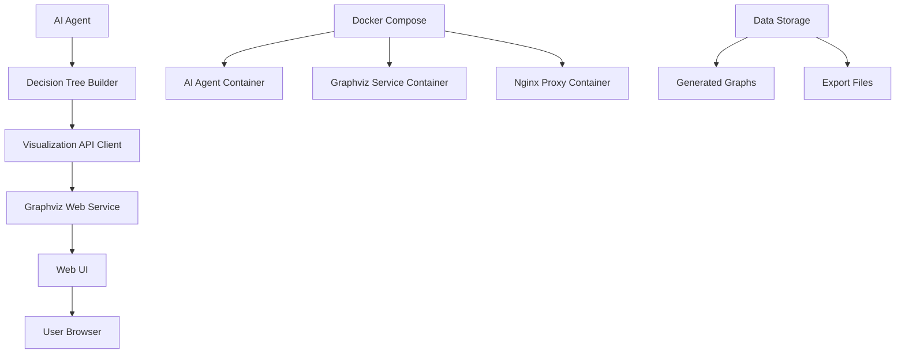
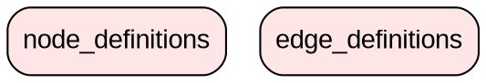

# Дизайн системы визуализации дерева решений

## Обзор

Система визуализации дерева решений состоит из веб-сервиса на базе Graphviz с REST API, интегрированного в существующую архитектуру AI агента через Docker Compose.

## Архитектура



## Компоненты и интерфейсы

### 1. Graphviz Web Service

**Технологии:**

- **Backend**: Python Flask/FastAPI
- **Graphviz**: Python graphviz библиотека
- **Frontend**: HTML/CSS/JavaScript с D3.js для интерактивности
- **Docker**: Официальный Python образ + Graphviz

**API Endpoints:**

```
POST /api/graph/create
- Input: JSON с данными дерева
- Output: {graph_id, preview_url, status}

GET /api/graph/{graph_id}
- Output: HTML страница с визуализацией

GET /api/graph/{graph_id}/export/{format}
- Formats: png, svg, pdf, dot
- Output: Файл для скачивания

GET /api/graph/{graph_id}/data
- Output: JSON с данными графа

DELETE /api/graph/{graph_id}
- Удаление графа и связанных файлов
```

### 2. Visualization API Client (в AI Agent)

**Расположение**: `ai_agent/utils/visualization_client.py`

**Основные методы:**

```python
class VisualizationClient:
    def __init__(self, base_url: str, enabled: bool = True)
    def create_graph(self, tree_data: DecisionTree) -> Optional[str]
    def get_graph_url(self, graph_id: str) -> str
    def is_available(self) -> bool
    def export_graph(self, graph_id: str, format: str) -> bytes
```

### 3. Decision Tree Data Converter

**Расположение**: `ai_agent/utils/tree_converter.py`

**Форматы вывода:**

- **DOT format** для Graphviz
- **JSON format** для веб-интерфейса
- **Mermaid format** как альтернатива

### 4. Web UI Components

**Frontend структура:**

```
/static/
├── css/
│   ├── main.css
│   └── themes/
│       ├── light.css
│       └── dark.css
├── js/
│   ├── graph-viewer.js
│   ├── export-handler.js
│   └── zoom-pan.js
└── templates/
    ├── graph.html
    └── error.html
```

**Функциональность:**

- Zoom и Pan для больших графов
- Tooltip с детальной информацией узлов
- Цветовое кодирование вероятностей
- Экспорт в различные форматы
- Responsive дизайн

## Модели данных

### Decision Tree JSON Schema

```json
{
  "type": "object",
  "properties": {
    "id": { "type": "string" },
    "query_type": { "type": "string" },
    "timestamp": { "type": "string", "format": "date-time" },
    "root": {
      "type": "object",
      "properties": {
        "id": { "type": "string" },
        "label": { "type": "string" },
        "description": { "type": "string" },
        "probability": { "type": "number", "minimum": 0, "maximum": 1 },
        "children": {
          "type": "array",
          "items": { "$ref": "#/properties/root" }
        },
        "metadata": {
          "type": "object",
          "properties": {
            "color": { "type": "string" },
            "shape": { "type": "string" },
            "style": { "type": "string" }
          }
        }
      },
      "required": ["id", "label", "probability"]
    },
    "statistics": {
      "type": "object",
      "properties": {
        "total_nodes": { "type": "integer" },
        "total_paths": { "type": "integer" },
        "max_depth": { "type": "integer" },
        "generation_time": { "type": "number" }
      }
    }
  },
  "required": ["id", "query_type", "root"]
}
```

### DOT Template для Graphviz



## Обработка ошибок

### Категории ошибок

1. **SERVICE_UNAVAILABLE** - Сервис визуализации недоступен
2. **GRAPH_GENERATION_FAILED** - Ошибка генерации графа
3. **EXPORT_FAILED** - Ошибка экспорта файла
4. **INVALID_DATA** - Некорректные данные дерева
5. **TIMEOUT** - Превышение времени ожидания

### Стратегии обработки

```python
class VisualizationErrorHandler:
    def handle_service_unavailable(self) -> None:
        """Переключение на текстовый режим"""
        logger.warning("Visualization service unavailable, falling back to text mode")
        self.fallback_to_text = True

    def handle_generation_timeout(self, tree_data: dict) -> None:
        """Упрощение дерева при таймауте"""
        simplified_tree = self.simplify_tree(tree_data)
        return self.retry_generation(simplified_tree)

    def handle_export_error(self, format: str) -> None:
        """Предложение альтернативных форматов"""
        alternative_formats = self.get_alternative_formats(format)
        logger.error(f"Export to {format} failed, try: {alternative_formats}")
```

## Стратегия тестирования

### Unit тесты

1. **Tree Converter Tests**

   - Конвертация DecisionTree в DOT формат
   - Конвертация в JSON формат
   - Обработка edge cases (пустые деревья, циклы)

2. **Visualization Client Tests**

   - API вызовы к сервису визуализации
   - Обработка ошибок сети
   - Fallback на текстовый режим

3. **Graph Generation Tests**
   - Генерация корректного DOT кода
   - Применение стилей и цветов
   - Экспорт в различные форматы

### Integration тесты

1. **End-to-End Workflow**

   - Полный цикл: генерация дерева → визуализация → экспорт
   - Тестирование с различными типами запросов
   - Проверка производительности

2. **Docker Integration**

   - Запуск всех сервисов через docker-compose
   - Проверка сетевого взаимодействия
   - Тестирование с различными конфигурациями

3. **API Integration**
   - Тестирование всех API endpoints
   - Проверка форматов ответов
   - Тестирование ошибочных сценариев

### Performance тесты

1. **Load Testing**

   - Одновременная генерация множества графов
   - Тестирование с большими деревьями (>100 узлов)
   - Проверка использования памяти

2. **Response Time Testing**
   - Время генерации графов различной сложности
   - Время экспорта в различные форматы
   - Время загрузки веб-интерфейса

## Docker конфигурация

### Graphviz Service Dockerfile

```dockerfile
FROM python:3.10-slim

# Установка Graphviz
RUN apt-get update && apt-get install -y \
    graphviz \
    graphviz-dev \
    && rm -rf /var/lib/apt/lists/*

# Установка Python зависимостей
COPY requirements.txt .
RUN pip install --no-cache-dir -r requirements.txt

# Копирование приложения
COPY . /app
WORKDIR /app

# Создание директорий для данных
RUN mkdir -p /app/data/graphs /app/data/exports

EXPOSE 8080

CMD ["python", "app.py"]
```

### Docker Compose интеграция

```yaml
services:
  # Существующие сервисы...

  graphviz-service:
    build: ./services/graphviz
    ports:
      - "8080:8080"
    volumes:
      - ./data/graphs:/app/data/graphs
      - ./data/exports:/app/data/exports
    environment:
      - FLASK_ENV=production
      - MAX_GRAPH_SIZE=1000
      - CLEANUP_INTERVAL=3600
    healthcheck:
      test: ["CMD", "curl", "-f", "http://localhost:8080/health"]
      interval: 30s
      timeout: 10s
      retries: 3
    restart: unless-stopped

  nginx-proxy:
    image: nginx:alpine
    ports:
      - "80:80"
    volumes:
      - ./nginx.conf:/etc/nginx/nginx.conf
    depends_on:
      - ai-agent
      - graphviz-service
    restart: unless-stopped
```

### Nginx конфигурация

```nginx
events {
    worker_connections 1024;
}

http {
    upstream graphviz {
        server graphviz-service:8080;
    }

    server {
        listen 80;

        location /graphs/ {
            proxy_pass http://graphviz/;
            proxy_set_header Host $host;
            proxy_set_header X-Real-IP $remote_addr;
        }

        location / {
            # Основное приложение
            proxy_pass http://ai-agent:8000/;
        }
    }
}
```

## Конфигурация и переменные окружения

### AI Agent переменные

```bash
# Визуализация
VISUALIZATION_ENABLED=true
VISUALIZATION_SERVICE_URL=http://graphviz-service:8080
VISUALIZATION_TIMEOUT=30
VISUALIZATION_FALLBACK=true

# Настройки графов
GRAPH_MAX_NODES=200
GRAPH_DEFAULT_THEME=light
GRAPH_EXPORT_FORMATS=png,svg,pdf
GRAPH_CLEANUP_HOURS=24

# Производительность
GRAPH_GENERATION_TIMEOUT=30
GRAPH_PARALLEL_LIMIT=5
```

### Graphviz Service переменные

```bash
# Сервис
FLASK_ENV=production
PORT=8080
HOST=0.0.0.0

# Graphviz настройки
MAX_GRAPH_SIZE=1000
DEFAULT_DPI=300
SUPPORTED_FORMATS=png,svg,pdf,dot

# Хранение
DATA_DIR=/app/data
CLEANUP_INTERVAL=3600
MAX_STORAGE_MB=1000

# Безопасность
MAX_REQUEST_SIZE=10MB
RATE_LIMIT=100/hour
```

## Безопасность

### Валидация входных данных

1. **Размер данных**: Ограничение размера JSON (макс. 10MB)
2. **Структура дерева**: Проверка на циклы и глубину
3. **Санитизация**: Очистка пользовательского ввода
4. **Rate limiting**: Ограничение частоты запросов

### Изоляция процессов

1. **Docker контейнеры**: Изоляция сервисов
2. **Временные файлы**: Автоматическая очистка
3. **Ограничения ресурсов**: CPU и память лимиты
4. **Сетевая безопасность**: Внутренние сети Docker

## Мониторинг и логирование

### Метрики

1. **Производительность**:

   - Время генерации графов
   - Использование памяти и CPU
   - Количество активных графов

2. **Использование**:

   - Количество созданных графов
   - Популярные форматы экспорта
   - Ошибки и их частота

3. **Ресурсы**:
   - Дисковое пространство
   - Сетевой трафик
   - Время отклика API

### Логирование

```python
# Структурированные логи
{
    "timestamp": "2024-01-15T10:30:45Z",
    "level": "INFO",
    "service": "graphviz-service",
    "operation": "create_graph",
    "graph_id": "abc123",
    "nodes_count": 25,
    "generation_time": 2.34,
    "export_format": "svg",
    "user_agent": "AI-Agent/1.0"
}
```

## Развертывание и масштабирование

### Горизонтальное масштабирование

1. **Load Balancer**: Nginx для распределения нагрузки
2. **Множественные инстансы**: Docker Swarm или Kubernetes
3. **Shared Storage**: Общее хранилище для графов
4. **Кэширование**: Redis для кэширования результатов

### Мониторинг здоровья

1. **Health Checks**: HTTP endpoints для проверки состояния
2. **Автоматический перезапуск**: При сбоях сервиса
3. **Алерты**: Уведомления о проблемах
4. **Метрики**: Prometheus + Grafana для мониторинга
