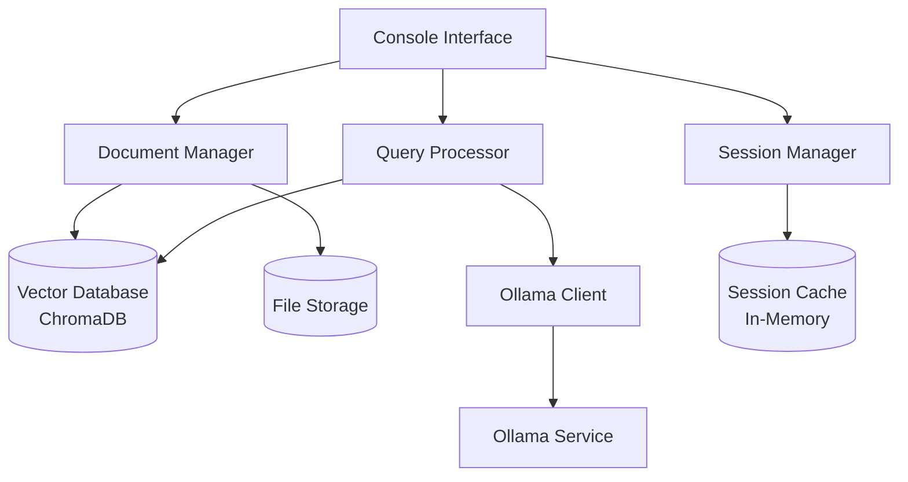

# Design Document

## Overview

Локальный AI агент представляет собой консольное Python-приложение для Ubuntu, которое интегрируется с Ollama для обработки естественного языка и использует векторную базу данных для эффективного поиска по документам. Система построена на модульной архитектуре с четким разделением ответственности между компонентами.

## Architecture

### High-Level Architecture



### Technology Stack

- **Interface**: Python CLI с Click - консольный интерфейс
- **Vector Database**: ChromaDB - для хранения и поиска векторных представлений документов
- **LLM Integration**: Ollama Python Client - для взаимодействия с локальными моделями
- **Session Storage**: In-memory storage - для управления сессиями
- **File Processing**: Python libraries (python-docx, PyPDF2, markdown) - для обработки различных форматов
- **CLI Enhancement**: Rich library - для красивого вывода в терминале

## Components and Interfaces

### 1. Document Manager

**Responsibilities:**

- Загрузка и валидация документов
- Извлечение текста из различных форматов
- Разбиение документов на чанки
- Создание векторных представлений
- Управление индексом документов

**Interface:**

```python
class DocumentManager:
    def upload_document(self, file_path: str, metadata: dict) -> str
    def delete_document(self, document_id: str) -> bool
    def get_document_info(self, document_id: str) -> dict
    def search_similar_chunks(self, query: str, top_k: int = 5) -> List[dict]
    def list_documents(self) -> List[dict]
```

### 2. Query Processor

**Responsibilities:**

- Обработка пользовательских запросов
- Поиск релевантных документов
- Формирование контекста для LLM
- Генерация ответов через Ollama
- Обработка специальных типов запросов (проверка документов)

**Interface:**

```python
class QueryProcessor:
    def process_general_query(self, query: str, session_id: str) -> dict
    def process_document_check(self, document_content: str, session_id: str) -> dict
    def get_relevant_context(self, query: str) -> List[str]
```

### 3. Session Manager

**Responsibilities:**

- Создание и управление сессиями
- Сохранение истории общения
- Управление контекстом сессии
- Очистка старых сессий

**Interface:**

```python
class SessionManager:
    def create_session(self) -> str
    def get_session_history(self, session_id: str) -> List[dict]
    def add_message(self, session_id: str, message: dict) -> None
    def clear_session(self, session_id: str) -> bool
    def delete_session(self, session_id: str) -> bool
```

### 4. Ollama Client

**Responsibilities:**

- Подключение к локальному Ollama сервису
- Отправка запросов к моделям
- Обработка ответов
- Управление различными моделями

**Interface:**

```python
from ollama import Client

class OllamaClient:
    def __init__(self):
        self.client = Client(host=os.getenv("OLLAMA_HOST"))

    def generate_response(self, prompt: str, model: str = "llama3.1") -> str
    def check_model_availability(self, model: str) -> bool
    def list_available_models(self) -> List[str]
    def health_check(self) -> bool
```

## Data Models

### Document Model

```python
@dataclass
class Document:
    id: str
    filename: str
    content: str
    metadata: dict
    upload_date: datetime
    file_type: str
    chunk_count: int
```

### Session Model

```python
@dataclass
class Session:
    id: str
    created_at: datetime
    last_activity: datetime
    messages: List[Message]

@dataclass
class Message:
    id: str
    session_id: str
    content: str
    role: str  # 'user' or 'assistant'
    timestamp: datetime
    sources: List[str]  # ссылки на документы
```

### Query Response Model

```python
@dataclass
class QueryResponse:
    answer: str
    sources: List[DocumentSource]
    confidence: float
    session_id: str

@dataclass
class DocumentSource:
    document_id: str
    filename: str
    chunk_text: str
    relevance_score: float
```

## Error Handling

### Error Categories

1. **Connection Errors**

   - Ollama service недоступен
   - ChromaDB connection failed
   - Network timeouts

2. **Validation Errors**

   - Неподдерживаемый формат файла
   - Пустой или поврежденный документ
   - Недопустимые параметры запроса

3. **Processing Errors**
   - Ошибки извлечения текста
   - Ошибки векторизации
   - LLM generation failures

### Error Response Format

```python
@dataclass
class ErrorResponse:
    error_code: str
    message: str
    details: dict
    timestamp: datetime
```

### Retry Strategy

- Exponential backoff для сетевых запросов
- Circuit breaker pattern для Ollama подключений
- Graceful degradation при недоступности компонентов

## Testing Strategy

### Unit Tests

- Тестирование каждого компонента изолированно
- Mock объекты для внешних зависимостей
- Покрытие edge cases и error scenarios

### Integration Tests

- Тестирование взаимодействия между компонентами
- End-to-end тесты основных сценариев
- Тестирование с реальными Ollama моделями

### Performance Tests

- Нагрузочное тестирование поиска по векторной БД
- Тестирование времени отклика LLM
- Memory usage и resource consumption

### Test Data

- Набор тестовых документов различных форматов
- Предопределенные запросы для regression testing
- Mock responses для стабильного тестирования

## Security Considerations

### Data Privacy

- Все данные обрабатываются локально
- Нет передачи данных во внешние сервисы
- Шифрование чувствительных данных в хранилище

### Input Validation

- Валидация всех пользовательских входов
- Sanitization загружаемых файлов
- Проверка путей к файлам и директориям

### Session Security

- Secure session tokens
- Session timeout mechanisms
- Protection against session hijacking

## Deployment Architecture

### Local Development

```
├── ai_agent/
│   ├── main.py              # CLI entry point
│   ├── cli/                 # CLI commands and interface
│   ├── core/                # Core business logic
│   ├── models/              # Data models
│   └── utils/               # Utility functions
├── data/
│   ├── documents/           # Uploaded documents
│   └── chroma_db/           # Vector database
├── tests/
├── requirements.txt
└── setup.py                 # Package setup for CLI installation
```

### Production Considerations

- Docker containerization
- Environment-specific configuration
- Logging and monitoring setup
- Backup strategies for document storage
